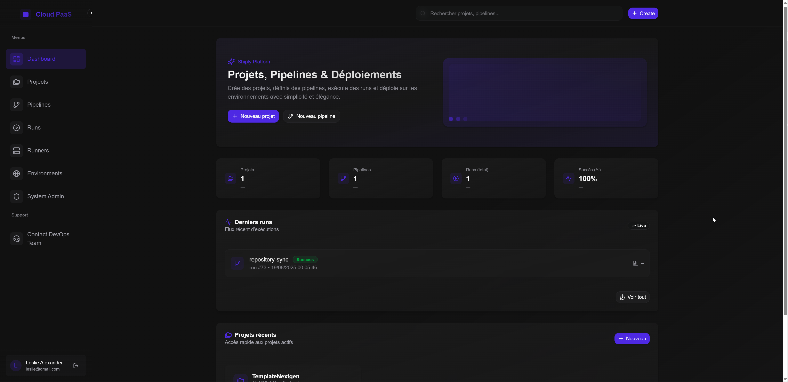
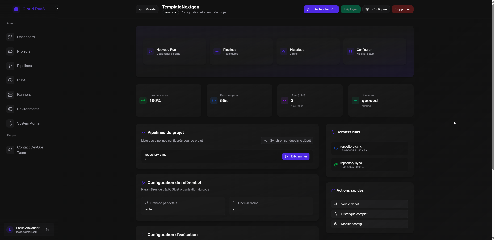

## Architecture logicielle et prototype fonctionnel (C2.2.1)

### Vue d’ensemble
Mono‑repo `Shiply` composé de 4 blocs principaux:
- `client` (React + Vite + TypeScript + Tailwind + shadcn/ui) – UI pipelines, runs, logs SSE.
- `server` (AdonisJS + TS + Lucid + JWT) – API REST, gestion des runners, pipelines et runs.
- `runner` (Bun + dockerode) – exécution des jobs dans des conteneurs, streaming de logs temps réel.
- `shared` (TypeScript) – types partagés (contrats entre client/server/runner).

### Principes d’architecture
- Séparation claire des responsabilités (UI, API, exécution, types partagés).
- Paradigmes: composants fonctionnels React + hooks, Redux Toolkit (slices/thunks), MVC côté API, services dédiés (validation YAML, repo workspace).
- Communication Client ↔ API via Axios; SSE pour les logs live et la mise à jour des statuts.
- Stockage: MySQL (migrations Lucid (adonis.js)).
- Sécurité: JWT, Helmet, CORS restrictif, rate limit.
- Observabilité: endpoint `/metrics` (Prometheus) + tableau de bord Grafana.

### Couverture des besoins et user stories (prototype fonctionnel)
- Création et configuration de projet (repo GitHub, `runMode`, variables d’environnement).
- Synchronisation de pipelines depuis un dépôt (validation YAML + création/MAJ côté Shiply).
- Exécution de pipelines: steps conteneurisés, logs en temps réel, agrégation des statuts.
- Déploiement via Shiply Deploy Manager.
- Historique des runs et consultation détaillée (`RunDetails`) avec actions Stop/Déployer.

### Composants UI présents et fonctionnels
- Navigation/routing (`react-router`), formulaires accessibles (labels `htmlFor`), boutons/menus via shadcn/ui.
- Cartes KPI, tableaux paginés, consoles de logs streamées (SSE) avec auto‑scroll et nettoyage.
- Accessibilité vérifiée (axe) sur composants critiques; focus visible et navigation clavier.

### Flux critiques
- Synchronisation pipeline YAML: GitHub → parse/validate (`ajv`) → persist pipeline.
- Exécution: le runner clone/MAJ le workspace project → lance Docker pour chaque step → push logs SSE.
- Déploiement: driver `compose`/`dockerfile`/`command` → logs → smoke test → statut agrégé.

### Bonnes pratiques de développement
- TypeScript strict, ESLint/Prettier, séparation logique par responsabilités, gestion d’erreurs centralisée.
- Redux Toolkit pour la logique asynchrone (thunks) et un état prévisible.
- Tests automatiques: front (Vitest/RTL + axe), API (Japa/supertest), runner (intégration ciblée).

### Décisions techniques
- `dockerode` pour compatibilité multi‑OS (Windows pipe/TCP, Linux socket).
- AdonisJS pour un cadre MVC robuste, validations et ORM Lucid.
- `turbo` pour l’orchestration monorepo et la mise en cache des tâches.

### Hypothèses
- Docker accessible depuis le runner (Windows possible via `DOCKER_HOST=tcp://localhost:2375`).
- Token GitHub stocké chiffré pour la synchronisation de pipeline.

### Aperçu du prototype

Cet écran illustre:
- Bonnes pratiques: UI React/TypeScript structurée (shadcn/ui, Tailwind), navigation claire, accessibilité (focus/labels).
- Prototype fonctionnel: création projets/pipelines, KPIs (projets, pipelines, runs, succès), derniers runs visibles.
- Cohérence des fonctionnalités: actions « Nouveau projet/pipeline », sections runs et projets récents alignées aux user stories.
- Composants d’interface opérationnels: boutons, menus, cartes KPI, liste des runs en direct.
- Exigences de sécurité satisfaites au niveau plateforme: authentification JWT, rôles/RBAC, logs masqués côté API (non visibles ici mais actifs dans le produit).

Cette vue confirme la cohérence fonctionnelle: KPIs (taux de succès, durée moyenne), derniers runs, pipelines du projet (ex: `repository-sync` en success), et actions rapides (déclencher, déployer, configurer), alignées aux user stories.

### Liens
- Voir `docs/C2.1.2_protocole-integration-continue.md` et `docs/C2.1.1_protocole-deploiement-continu.md`.
